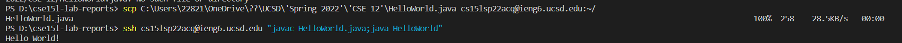

# Lab Report 1
## Turorial to login into ieng6

### Step 1 Installing VScode

1. download vsc from [Visual Studio Code](https://code.visualstudio.com/)
2. install vsc 

___

### Step 2 Remotely Connecting

- use the command above to create ssh connection with the server ieng6
- replace acq with the user name you are given to
- enter the password
___

### Step 3 Trying Some Commands
- use some of these the commands in the terminal

- the command will operate based on the platform you are at (local / remote)

**local**

**remote**
___

### Step 4 Moving Files with scp

- use the command `scp WhereAmI.java cs15lsp22acq@ieng6.ucsd` to copy a file

- successful copy command will load a progress bar.
___

### Step 5 Setting an SSH Key

- generate a key on your computer by command 'ssh-keygen'
- enter empty input for the following options

- use the command `scp {file path} {username}@{domain}:{target location}`
- copy the public key file to the server path at '~/.ssh/authorized_keys'
- You are done!

*quick login demo*

___

### Step 6 Optimizing Remote Running
- to optimize the copy operation to a remote server is:
1. setup the ssh key
2. combine multiple commands in the same line

eg: to copy and run a file to a server with ssh key set.

command1: `scp {file path}@{server domain}: target path`

command2: `ssh {username} {Command 1};{Command 2}`

___
