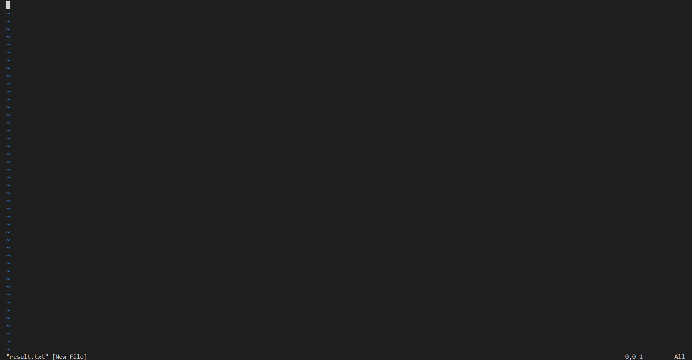
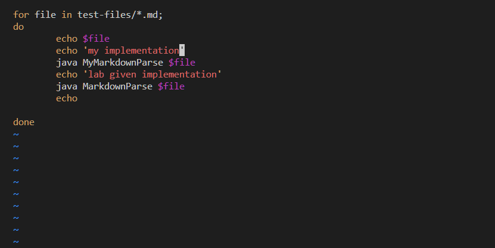
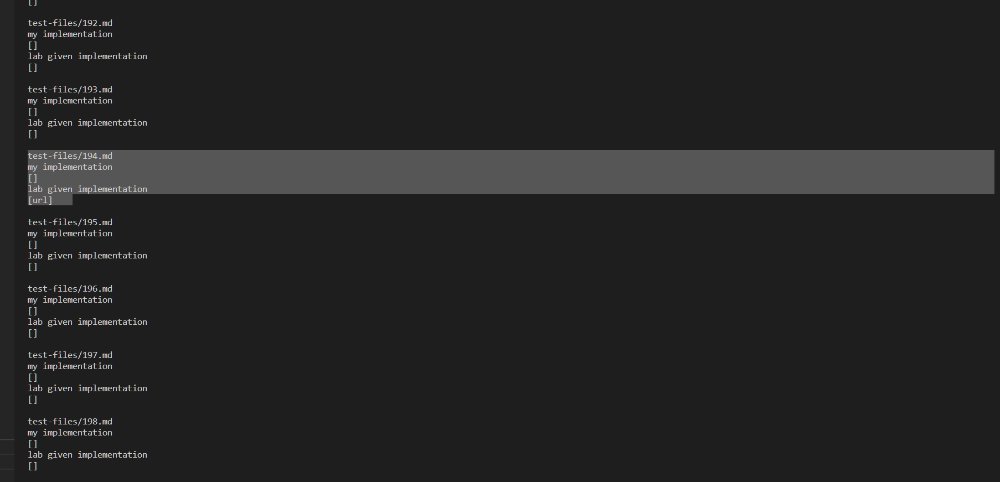
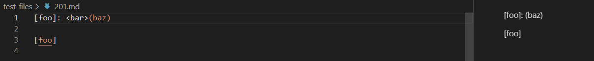
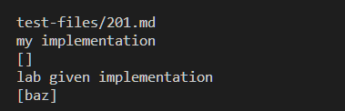
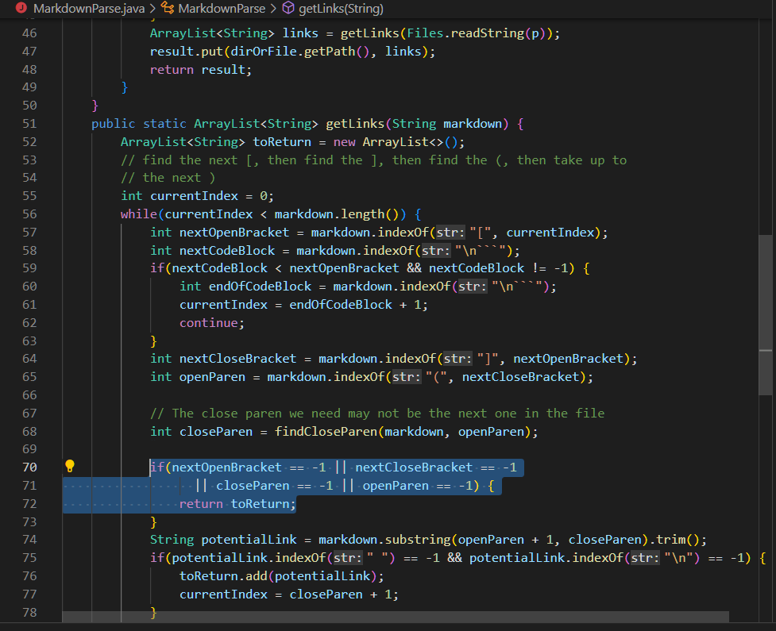

# Lab Report 5
## Finding different implementations

### Finding difference between results

- Due to UI bug on my computer, I cannot use vim editor to search for differences over a certain amount of lines in command window. So I printed out the results of test in command terminal and serached for difference manually.

- So I uploaded my `MarkdownParse.java` to the same directory and changed the file name to `MyMarkdownParse.java`, and edited the `script.sh` file to make it print out the results at the same time in the command window. 

- output in command line

### [The link to test file](https://github.com/nidhidhamnani/markdown-parser/blob/main/test-files/201.md)
- the expected output shown by VSC preview window

 - exptected: `my_(url)`. 
- actual:

So my implementation is correct. 

-  Possible solution:

For the highlighted part, there should be another condition to determine whether the brackets are closely followed by parenthesis. For exmaple, determine if the first string comes up after the close bracket is the open parenthesis.  

