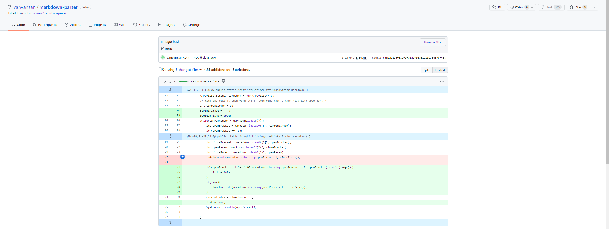
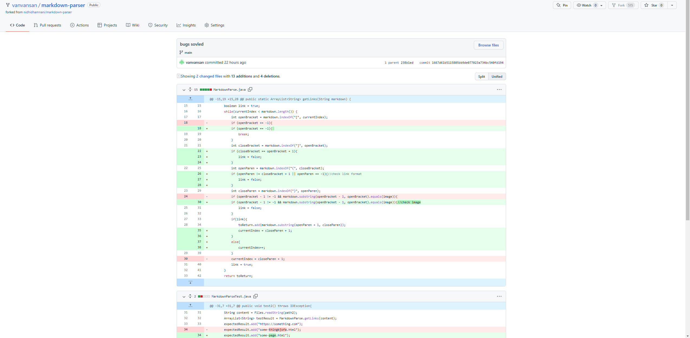

# Lab Report 2
## Debugging process

### Bug one: failure to end

[failure inducing file link](https://github.com/vanvansan/markdown-parser/edit/main/test-file.md)

Symptoms:

Bug: the program does not have a condition checking for ending boundary. The program keeps looking for next open bracket even where there are none left.
___

### Bug two: failure to differenciate between an image file and a link

[failure inducing file link](https://github.com/vanvansan/markdown-parser/blob/c3dbaa2e5f682fefa1a07b8a51a1de754576f458/imagetest.md)

Symptoms:

Bug: The program will extract the image file path as a link. This is due to the lack of checking if the content in the brackets is image.
___

### Bug three: failure to run a file without links

[failure inducing file link](https://github.com/vanvansan/markdown-parser/blob/238b1ed04a0c53a53fa4f9c97e133774932954c5/test-file3.md)

Symptoms:

Bug: The program did not jump out of the loop when there is no bracket/parenthesis. When the open bracket is not found, it will find the close bracket at index -1, which will throw index out of bound exception.
___

