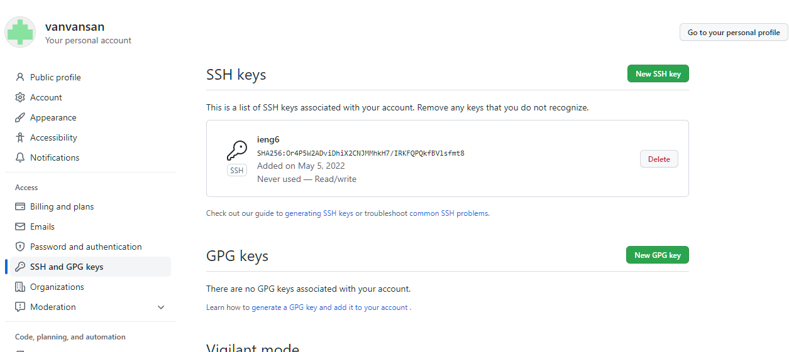

# Lab Report 3  

### Streamlining ssh Configuration

1. The `config` file. Edited with notepad.

2. the `ssh` command to login to the account

2. the `scp` command to copy a file to the account

___

### Setup Github Access from ieng6

- the public key

- the private key

- [commit link](https://github.com/vanvansan/cse15l-lecture2/commit/94fe26f85068ce7fd6f807da3cd934e10fe7331c)

___

### Copy Whole Directories with `scp -r`

- copy the markdown-paser directory

- compiling and running the test on ieng6

- combining multiple commands in the same line

