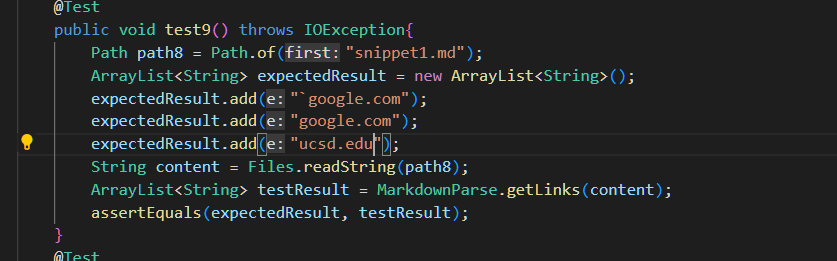
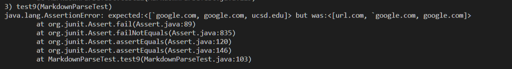
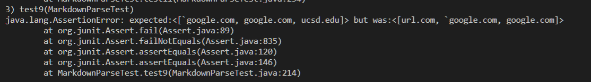
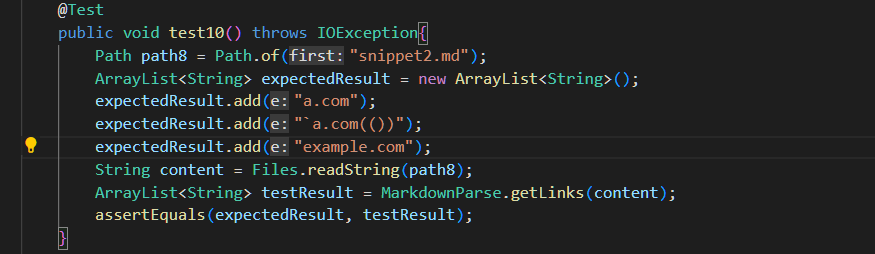
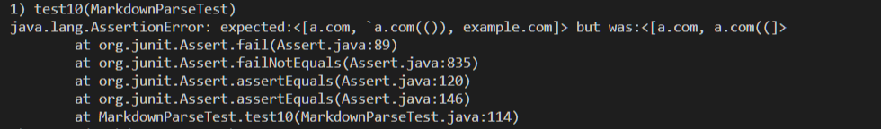
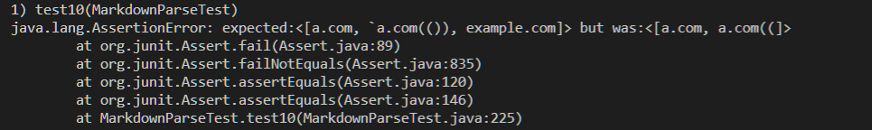
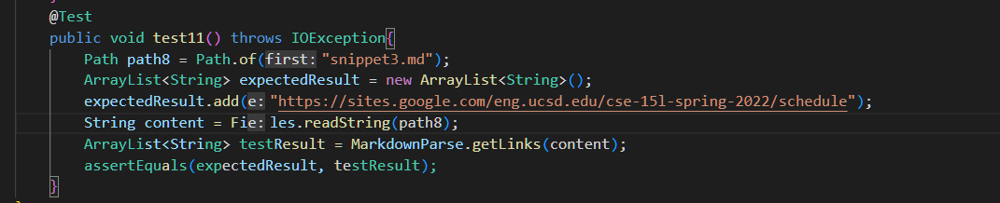
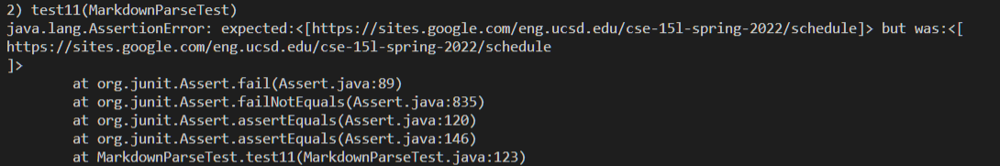
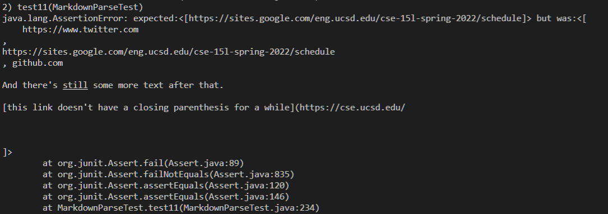

# Lab Report 4

## Repositories

[My repository](https://github.com/vanvansan/markdown-parser)

[Reviewed repository](https://github.com/calistajlee/lab6-markdown-parser)

___

## Expected results

- Snippet 1:

    1. Expected results: ```[`google.com,google.com,ucsd.edu]```
    2. test code screenshot 
    3. My test output screenshot 
    4. Reviewed project output screentshot  

- Snippet 2:

    1. Expected results: ```[a.com,`a.com(()),example.com]```
    2. test code screenshot 
    3. My test output screenshot 
    4. Reviewed project output screentshot  

- Snippet 3:

    1. Expected results: ```[https://sites.google.com/eng.ucsd.edu/cse-15l-spring-2022/schedule]```
    2. test code screenshot 
    3. My test output screenshot 
    4. Reviewed project output screentshot  


___

## Q&A

- Do you think there is a small (<10 lines) code change that will make your program work for snippet 1 and all related cases that use inline code with backticks? If yes, describe the code change. If not, describe why it would be a more involved change.

    Answer:
    

- Do you think there is a small (<10 lines) code change that will make your program work for snippet 2 and all related cases that nest parentheses, brackets, and escaped brackets? If yes, describe the code change. If not, describe why it would be a more involved change.

- Do you think there is a small (<10 lines) code change that will make your program work for snippet 3 and all related cases that have newlines in brackets and parentheses? If yes, describe the code change. If not, describe why it would be a more involved change.